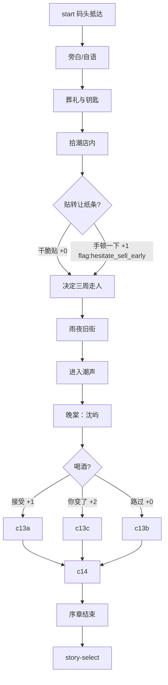
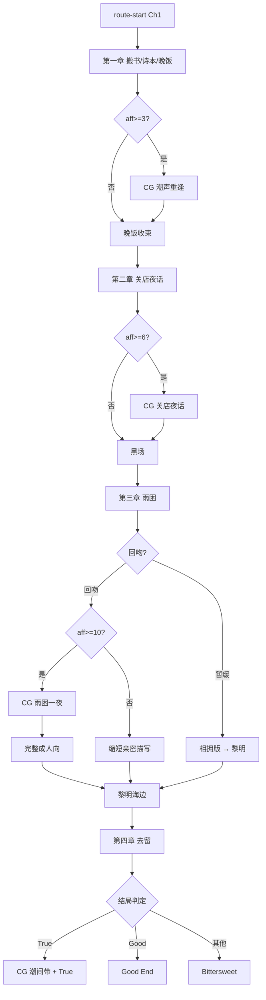
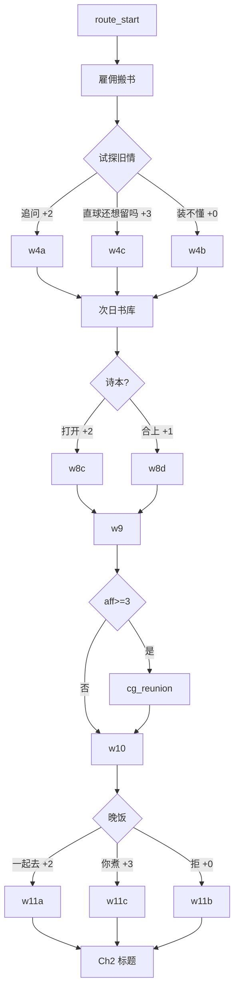

# 《潮间带》设计稿（待审阅）

> **状态：等待你确认后再写剧本代码与资源。**  
> 本文只定：世界观、人物、好感、章节、节点图、资源清单。

---

## 1. 一句话

父亲去世后，沈屿回潮屿卖铺；三个月潮汛里，他与镇上四个女人重新学会「靠近」与「留下」。

**主题**：退潮才露出真实 · 涨潮又会淹没选择。  
**调性**：文学向成人 gal · 合意 · 情绪张力优先于猎奇。

---

## 2. 世界观与场景

| 地点 key | 名称 | 用途 |
|----------|------|------|
| port-night | 潮屿码头 · 夜 | 抵达 / 离别 |
| street-rain | 旧街 · 细雨 | 过渡、偶遇 |
| shop-interior | 拾潮 · 店内 | 主角据点 |
| shop-back | 拾潮 · 后仓 | 整理旧物、回忆父亲 |
| bookstore | 潮声 · 营业中 | 晚棠主场景 |
| bookstore-close | 潮声 · 打烊 | 夜话、亲密 |
| hotel-lobby | 潮屿酒店 · 大堂夜 | 晴岚线 |
| hotel-bar | 酒店酒吧 | 晴岚喝酒戏 |
| research-station | 海洋站 · 实验室 | 清禾线 |
| tide-pools | 潮间带岩滩 · 昼 | 清禾科考 / 隐喻场景 |
| gallery | 海边画廊 | 知夏线 |
| seaside-dawn | 海边 · 黎明 | 结局 / 告白 |
| wantang-room | 晚棠阁楼 | 可选亲密后日谈 |
| black | 黑场 | 章节转场 |

视觉：深蓝夜海 · 琥珀灯 · 湿玻璃 · 旧纸 · 细雨噪点。

---

## 3. 人物卡

### 3.1 沈屿（主角 · 28）

- 城市打工十年，不善表达，习惯用「处理完就走」逃避。
- 弧光：从「卖铺走人」→「承认自己也曾想被留下」。
- 无立绘也可；若有，半身侧影即可。

### 3.2 林晚棠 ★首发（27）

| 项 | 内容 |
|----|------|
| 身份 | 「潮声」深夜书店兼吧台 |
| 气质 | 冷、克制、话少却准；酒后才软 |
| 与屿 | 中学后排；送行未开口；十年未离开潮屿 |
| 怕什么 | 说完就会被留下的人再次抛弃 |
| 想要 | 被选择，而不是被「顺便记得」 |
| 立绘表情 | default / soft / tense / blush / avert / smile / hurt |
| 服装 | 亚麻衬衫、围裙、随意束发；夜戏换宽松家居 |

### 3.3 苏晴岚（29）· 二期

- 酒店夜班经理；职业笑脸下极度孤独。
- 关键词：短暂停泊、对班、清醒的一夜情也可能变成习惯。
- 好感轴：信任揭下面具 > 身体靠近。

### 3.4 顾清禾（31）· 二期

- 海洋生态研究员；说话像论文摘要，直球问亲密问题。
- 关键词：观察与被观察、寄居蟹/藤壶隐喻「依附与自立」。
- 好感轴：被当作平等对话者 > 浪漫套路。

### 3.5 叶知夏（23）· 二期

- 画廊助理 / 业余插画；怕被当小孩，怕被「可爱」打发。
- 关键词：夏天的尾巴、被认真对待、创作与自我。
- 好感轴：尊重她的作品与边界 > 宠溺。

---

## 4. 好感度系统设计（丰度）

### 4.1 数值

- 每条线独立亲密度 `affection[charId]`，区间建议 **0–20**。
- 选项增量：`-2 / -1 / 0 / +1 / +2 / +3`（关键坦白可 +3）。
- HUD：当前线亲密度 + 下一 CG 门槛提示 + 增减飘字。

### 4.2 阈值（晚棠线示例，可调）

| 阈值 | 效果 |
|------|------|
| 3 | 解锁小事件「未寄出的诗」可完整阅读；CG1 |
| 6 | 解锁夜话深度回忆；CG2 |
| 10 | 解锁成人向完整版 + CG3（低好感走相拥版） |
| 14 | 解锁 True 向后日谈入口；CG4（或 True End 强制） |
| 关键 | `stay` / `confess` / `intimate_night` 等 |

### 4.3 结局公式（晚棠）

```
True         = affection≥12 AND stay AND confess
Good         = affection≥7  AND (stay OR confess)
Soft Good    = affection≥7  AND intimate_night AND !stay   （可选第四结局）
Bittersweet  = else
```

> 审阅点：是否要第四结局 Soft Good？默认 **先做三结局**，Soft Good 标为可选。

### 4.4 CG 图鉴

永久 `localStorage`；标题页「CG 鉴赏」。低好感周目看不到高阶 CG。

---

## 5. 总体结构

```
标题
 └─ 开始 → 序章 common（加厚）
              └─ 角色选择
                   ├─ 林晚棠线 wantang（本期完整实现）
                   ├─ 苏晴岚线 qinglan（大纲预留）
                   ├─ 顾清禾线 qinghe（大纲预留）
                   └─ 叶知夏线 zhixia（大纲预留）
```

**节奏目标（晚棠）**

| 章 | 名 | 体量目标 | 选项数 | CG |
|----|----|----------|--------|-----|
| 序 | 抵达 | 18–25 节点 | 2–3 | — |
| 1 | 退潮的旧街 | 28–35 节点 | 5–6 | CG1@≥3 |
| 2 | 关店之后 | 25–32 节点 | 4–5 | CG2@≥6 |
| 3 | 雨困一夜 | 30–40 节点 | 4–5 | CG3@≥10 |
| 4 | 潮间带 | 18–24 节点 | 3–4 | CG4@True |

合计晚棠线约 **120–150 对话节点**（比现状约翻倍）。

---

## 6. 序章大纲（common）

1. 码头抵达 · 潮声与蝉  
2. 回忆离开的十年（短）  
3. 葬礼余波 · 钥匙  
4. 拾潮店内 · 贴「转让」纸条（选项：犹豫 / 干脆贴上）  
5. 翻到旧账本 / 童年物件（建立父亲羁绊）  
6. 雨夜出门找吃的  
7. 撞见「潮声」  
8. 与晚棠重逢对白（加厚：伞的回忆）  
9. 喝酒选项（三选）  
10. 「待多久」→ 一个月  
11. 序章结束 → 角色选择  

**序章结束时亲密度**：0–3（影响第一章 CG 是否更容易触发）。

---

## 7. 林晚棠线章节大纲

### Ch1 退潮的旧街

- 雇佣式求助搬书 → 试探旧情  
- 二楼书库 · 后颈 · 未寄出诗本（高好感可读全文）  
- 傍晚大麦茶 → **aff≥3 → CG 潮声重逢**  
- 晚饭三选：粥摊 / 她煮 / 拒  
- 伏笔：买家中介来电（可打断温情）

### Ch2 关店之后

- 雨夜敲门打烊店  
- 红酒 · 「不想一个人喝完」  
- 卖铺拷问（三选）  
- 差点吻上 · 节奏选择  
- **aff≥6 → CG 关店夜话**  
- 黑场：「岸已经湿了」

### Ch3 雨困一夜

- 台风短信「来潮声」  
- 蜡烛 · 毯子 · 体温  
- 「十年前有没有回头」（三选）  
- 她先吻 · 同意/暂缓  
- **aff≥10 → CG 雨困一夜 → 完整成人向**；否则相拥版  
- 成人向：合意确认句 → 节奏描写（文学）→ 事后浅笑  
- 黎明海边 · 「潮间带」隐喻短讲

### Ch4 潮间带

- 买家下周来  
- 留下 / 卖掉+保持联系  
- 若留下：为你坦白 / 为父亲回避  
- 结局判定  
- True：联名店小黑板 + **CG 潮间带**

---

## 8. 剧情节点图（审阅用）

### 8.1 全局


### 8.2 序章节点图



### 8.3 晚棠线总图



### 8.4 晚棠 Ch1 细节点（实现用 ID 草案）



### 8.5 晚棠 Ch2–4 关键分歧（摘要）

| 节点 | 选项 | 好感 | Flag |
|------|------|------|------|
| 卖铺拷问 | 犹豫 / 取决于人 / 没什么好留 | +2 / +3 / -1 | hesitate_sell |
| 差点吻上 | 尊重节奏 / 等到不是前夜 / 别当前夜 | +2 / +3 / +2 | respect_pace / promise_wait |
| 有无回头 | 看了很久 / 不敢看 / 恨自己没跑回去 | +3 / +2 / +3 | looked_back |
| 吻后 | 回吻 / 怕你后悔 | +2 / +1 | intimate_night / intimate_delay |
| 去留 | 留下 / 卖掉保持联系 | +3 / 0 | stay |
| 留下追问 | 为你坦白 / 为父亲 | +2 / 0 | confess |

---

## 9. 资源清单（生成用 skill）

### 9.1 立绘（透明 PNG · RGBA · 建议 1024×1536）

| 文件 | 角色 | 表情 |
|------|------|------|
| wantang-default/smile/blush/hurt.png | 晚棠 | 已有，可重做更高质 |
| wantang-tense.png | 晚棠 | **建议补**独立 tense |
| qinglan-*.png | 晴岚 | 二期 |
| qinghe-*.png | 清禾 | 二期 |
| zhixia-*.png | 知夏 | 二期 |

### 9.2 背景（1536×1024 或 1920×1080）

现有 6 张 + 建议补：`shop-back` `hotel-lobby` `hotel-bar` `research-station` `tide-pools` `gallery` `wantang-room` 专用。

### 9.3 CG（1280×720+）

| id | 标题 | 门槛 |
|----|------|------|
| reunion | 潮声重逢 | 3 |
| nighttalk | 关店夜话 | 6 |
| rainnight | 雨困一夜 | 10 |
| intertidal | 潮间带 | 14 / True |

---

## 10. 实现分期（你确认大纲后）

| 期 | 内容 |
|----|------|
| **P0** | 按本文重写 common + wantang 节点与文案；调好感/CG；补 tense 立绘与缺背景 |
| P1 | CG 换正式插画（非立绘合成）；Gallery 完善 |
| P2 | 晴岚线完整 |
| P3 | 清禾 / 知夏 |

---

## 11. 请你拍板的问题

1. 晚棠线是否维持 **三结局**，还是加 Soft Good？  
2. 成人向是否必须 **aff≥10** 才进完整版？（当前设计：是）  
3. 本期是否 **只做晚棠**，另外三人只留选择页锁定？  
4. 立绘/背景：用现有图先顶着，还是确认后立刻按 skill 重生成？  
5. 节点体量：接受「晚棠约 120–150 节点」吗？若要更短/更长请说目标。

---

**确认方式**：直接回复「按这个做」或列出要改的条目。确认前 **不重写** `src/data/story/*` 实现稿。
