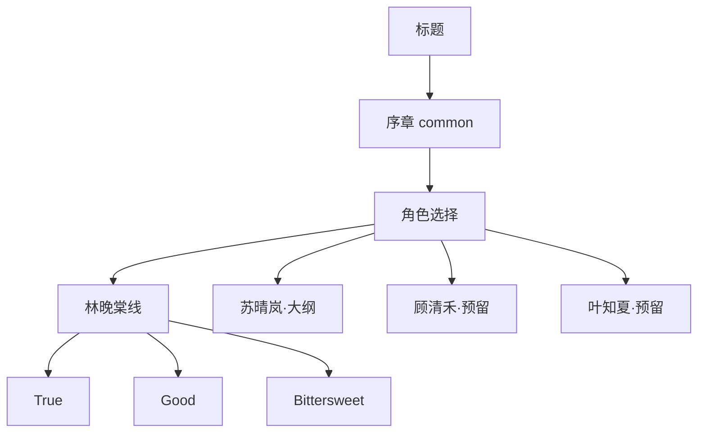
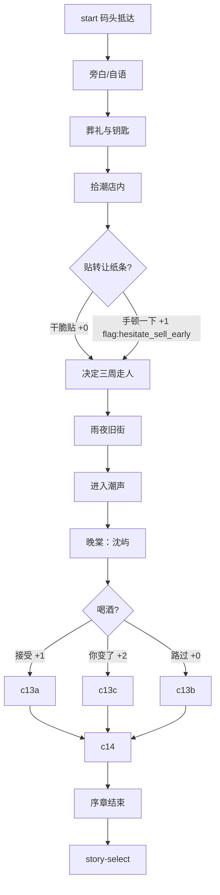
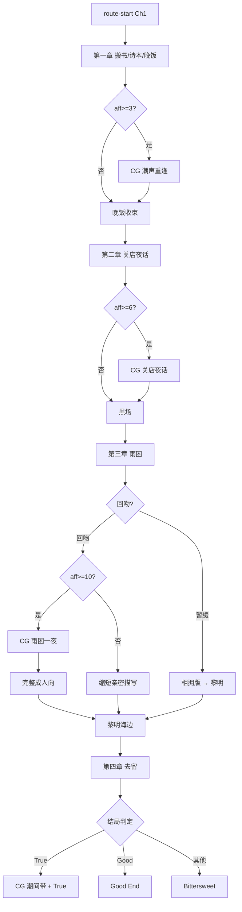
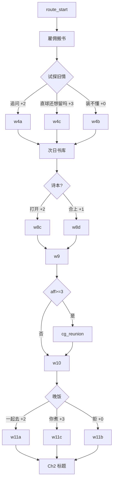

# 《潮间带》设计稿

> **状态：P0 剧本已按本稿实现（common + wantang）。**  
> 晴岚线 50 章大纲已定（§7b）；P2 实现与资源仍待后续。

---

## 1. 一句话

父亲去世后，沈屿回潮屿卖铺；三个月潮汛里，他与镇上四个女人重新学会「靠近」与「留下」。

**主题**：退潮才露出真实 · 涨潮又会淹没选择。  
**调性**：文学向成人 gal · 合意 · 情绪张力优先于猎奇。

---

## 2. 世界观与场景

| 地点 key | 名称 | 用途 |
|----------|------|------|
| port-night | 潮屿码头 · 夜 | 抵达 / 离别 |
| street-rain | 旧街 · 细雨 | 过渡、偶遇 |
| shop-interior | 拾潮 · 店内 | 主角据点 |
| shop-back | 拾潮 · 后仓 | 整理旧物、回忆父亲 |
| bookstore | 潮声 · 营业中 | 晚棠主场景 |
| bookstore-close | 潮声 · 打烊 | 夜话、亲密 |
| hotel-lobby | 潮屿酒店 · 大堂夜 | 晴岚线主场景 |
| hotel-lobby-storm | 大堂 · 台风停电 | 应急灯 / 沙袋 |
| hotel-bar | 酒店酒吧 | 晴岚喝酒 / 对班夜话 |
| hotel-duty | 酒店值班室 | 雨困、卸妆、亲密 |
| hotel-corridor | 酒店走廊 · 夜 | 几乎越线 |
| hotel-monitor | 酒店监控室 | 买家握手 / 审判 |
| hotel-service | 酒店卸货通道 | 后厨烟破绽 |
| hotel-room | 酒店客房 · 海景 | 潮间带隐喻窗边 |
| research-station | 海洋站 · 实验室 | 清禾线 |
| tide-pools | 潮间带岩滩 · 昼 | 清禾科考 / 隐喻场景 |
| gallery | 海边画廊 | 知夏线 |
| seaside-dawn | 海边 · 黎明 | 结局 / 告白 |
| wantang-room | 晚棠阁楼 | 可选亲密后日谈 |
| black | 黑场 | 章节转场 |

视觉：深蓝夜海 · 琥珀灯 · 湿玻璃 · 旧纸 · 细雨噪点。

---

## 3. 人物卡

### 3.1 沈屿（主角 · 28）

- 城市打工十年，不善表达，习惯用「处理完就走」逃避。
- 弧光：从「卖铺走人」→「承认自己也曾想被留下」。
- 无立绘也可；若有，半身侧影即可。

### 3.2 林晚棠 ★首发（27）

| 项 | 内容 |
|----|------|
| 身份 | 「潮声」深夜书店兼吧台 |
| 气质 | 冷、克制、话少却准；酒后才软 |
| 与屿 | 中学后排；送行未开口；十年未离开潮屿 |
| 怕什么 | 说完就会被留下的人再次抛弃 |
| 想要 | 被选择，而不是被「顺便记得」 |
| 立绘表情 | default / soft / tense / blush / avert / smile / hurt / laugh / surprised / teary / cold / tired；姿态 book / crossed |
| 服装 | 亚麻衬衫、围裙、随意束发；夜戏换宽松家居 |

### 3.3 苏晴岚（29）· 二期

| 项 | 内容 |
|----|------|
| 身份 | 潮屿酒店夜班经理 |
| 气质 | 爆乳干练 OL + 黑框眼镜；职业笑完美；紧身酒店制服、利落盘发、冷蓝调；私下极度孤独 |
| 与屿 | 无中学旧情。他回镇整理拾潮期间暂住酒店，她安排「员工价」——从此每晚大堂擦肩 |
| 怕什么 | 被当成可替换的服务态度；认真之后对方仍当短暂停泊 |
| 想要 | 有人在她摘下名牌之后还留下来 |
| 关键词 | 短暂停泊、对班、清醒的一夜情也可能变成习惯 |
| 好感轴 | 信任揭下面具 > 身体靠近 |
| 立绘表情 | default / soft / tense / blush / avert / smile / hurt / laugh / surprised / teary / cold / tired；姿态 crossed / lean |
| 服装 | 干练酒店制服 + 名牌；休班便装；夜戏可解领/便服 |
| 人物稿 | `docs/refs/qinglan-design-sheet-b.png`（造型定稿）· `qinglan-design-sheet-a.png`（表情姿态）· 说明见 `qinglan-design-notes.md` |
| 关键 Flag | `unmask`（卸妆/示弱）、`trust`（拒绝把她当夜班消遣）、`habit`（对班成习惯）、`stay` / `confess`、`intimate_night`（仅 trust + 高好感） |

**一句话**：沈屿在卖铺的三个月里，成了苏晴岚「对班」的固定停泊位——直到她发现，习惯比一夜更危险。

**与晚棠对照**：旧情被选择 vs 陌生揭面具；诗/伞/旧账 vs 名牌/班表/房卡/监控；怕抛弃 vs 怕被服务化。

目录：`src/data/story/qinglan/CHAPTERS.md`。

### 3.4 顾清禾（31）· 二期

- 海洋生态研究员；说话像论文摘要，直球问亲密问题。
- 关键词：观察与被观察、寄居蟹/藤壶隐喻「依附与自立」。
- 好感轴：被当作平等对话者 > 浪漫套路。

### 3.5 叶知夏（23）· 二期

- 画廊助理 / 业余插画；怕被当小孩，怕被「可爱」打发。
- 关键词：夏天的尾巴、被认真对待、创作与自我。
- 好感轴：尊重她的作品与边界 > 宠溺。

---

## 4. 好感度系统设计（丰度）

### 4.1 数值（百分制）

- 每条线独立亲密度 `affection`，区间 **0–100**（界面显示为 `%`）。
- 选项增量：`-10 / -5 / 0 / +5 / +10 / +15`（关键坦白可 +15）。
- 引擎 `clampAffection` 防止越界；HUD：进度条 + 百分比 + 下一 CG 门槛 + 增减飘字。
- 常量见 `src/data/affection.ts`（`AffThreshold`）。

### 4.2 阈值（晚棠线 · 百分制）

| 阈值 | 效果 |
|------|------|
| 15% | CG 潮声重逢 |
| 20% | CG 未寄出的诗 |
| 25% | CG 旧伞 |
| 30% | CG 关店夜话 |
| 35% | CG 市集早晨；Good 结局门槛 |
| 40% | CG 几乎吻上 |
| 45% | CG 和解的盐 |
| 50% | CG 雨困一夜 / 成人向完整版（低好感走相拥版） |
| 60% | True 结局门槛（+ stay + confess） |
| 70% | CG 潮间带 |
| 关键 | `stay` / `confess` / `intimate_night` 等 |

### 4.3 结局公式（晚棠）

```
True         = affection≥60 AND stay AND confess
Good         = affection≥35 AND (stay OR confess)
Bittersweet  = else
```

> **实现中**：三结局；百分制 0–100。

### 4.3b 结局公式（晴岚 · 大纲）

```
True         = affection≥60 AND stay AND confess AND trust
Good         = affection≥35 AND (stay OR confess)
Bittersweet  = else（他走或她重新戴上面具送他离开）
```

成人向完整版：`aff≥50 AND trust`；否则停在相拥 / 清醒止步。

### 4.4 CG 图鉴

永久 `localStorage`；标题页「CG 鉴赏」。低好感周目看不到高阶 CG。

---

## 5. 总体结构

```
标题
 └─ 开始 → 序章 common（加厚）
              └─ 角色选择
                   ├─ 林晚棠线 wantang（本期完整实现）
                   ├─ 苏晴岚线 qinglan（大纲已定 · P2 实现）
                   ├─ 顾清禾线 qinghe（大纲预留）
                   └─ 叶知夏线 zhixia（大纲预留）
```

**节奏目标（晚棠）——最少 50 章**

| 幕 | 章号 | 内容 |
|----|------|------|
| 重逢 | 1–15 | 雇佣、中介、诗本、CG1、晚饭、伞、常客、账本、小别 |
| 靠近 | 16–28 | 关店、红酒、卖铺、CG2、市集、争吵和解、谈到很晚 |
| 风暴 | 29–40 | 台风、雨夜 CG3/分流、成人向、黎明潮间带、假装平常 |
| 抉择 | 41–50 | 钥匙、买家、去留坦白、联名想象、结局分叉 |

单章体量：标题卡 + 数个对话/选项节点。全线约 **270+ 节点**。目录：`src/data/story/wantang/CHAPTERS.md`。

**节奏目标（晴岚）——最少 50 章（大纲）**

| 幕 | 章号 | 内容 |
|----|------|------|
| 停泊 | 1–15 | 名牌、员工价、对班咖啡、破绽、CG 停泊一夜、小别 |
| 对班 | 16–28 | 酒吧、短暂停泊坦白、卖铺拷问、几乎越线、争吵和解 |
| 卸妆 | 29–40 | 台风、来大堂、摘名牌、雨困值班室分流、假装前台 |
| 岸名 | 41–50 | 备用房卡、买家、去留坦白、联名想象、结局分叉 |

目录：`src/data/story/qinglan/CHAPTERS.md`。
---

## 6. 序章大纲（common）

1. 码头抵达 · 潮声与蝉  
2. 回忆离开的十年（短）  
3. 葬礼余波 · 钥匙  
4. 拾潮店内 · 贴「转让」纸条（选项：犹豫 / 干脆贴上）  
5. 翻到旧账本 / 童年物件（建立父亲羁绊）  
6. 雨夜出门找吃的  
7. 撞见「潮声」  
8. 与晚棠重逢对白（加厚：伞的回忆）  
9. 喝酒选项（三选）  
10. 「待多久」→ 一个月  
11. 序章结束 → 角色选择  

**序章结束时亲密度**：0–3（影响第一章 CG 是否更容易触发）。

---

## 7. 林晚棠线章节大纲

### Ch1 退潮的旧街

- 雇佣式求助搬书 → 试探旧情  
- 二楼书库 · 后颈 · 未寄出诗本（高好感可读全文）  
- 傍晚大麦茶 → **aff≥3 → CG 潮声重逢**  
- 晚饭三选：粥摊 / 她煮 / 拒  
- 伏笔：买家中介来电（可打断温情）

### Ch2 关店之后

- 雨夜敲门打烊店  
- 红酒 · 「不想一个人喝完」  
- 卖铺拷问（三选）  
- 差点吻上 · 节奏选择  
- **aff≥6 → CG 关店夜话**  
- 黑场：「岸已经湿了」

### Ch3 雨困一夜

- 台风短信「来潮声」  
- 蜡烛 · 毯子 · 体温  
- 「十年前有没有回头」（三选）  
- 她先吻 · 同意/暂缓  
- **aff≥10 → CG 雨困一夜 → 完整成人向**；否则相拥版  
- 成人向：合意确认句 → 节奏描写（文学）→ 事后浅笑  
- 黎明海边 · 「潮间带」隐喻短讲

### Ch4 潮间带

- 买家下周来  
- 留下 / 卖掉+保持联系  
- 若留下：为你坦白 / 为父亲回避  
- 结局判定  
- True：联名店小黑板 + **CG 潮间带**

---

## 7b. 苏晴岚线章节大纲（P2）

> **状态**：50 章可玩模块已生成（`ch01.ts`–`ch50.ts` + endings）；选择页已解锁。立绘/CG 暂占位。  
> 完整目录：`src/data/story/qinglan/CHAPTERS.md`。生成器：`node scripts/gen-qinglan.mjs`。

### 定位

| | 林晚棠 | 苏晴岚 |
|--|--------|--------|
| 关系起点 | 十年旧识 | 酒店初遇（无前情） |
| 主场景 | 潮声书店 | 潮屿酒店大堂 / 酒吧 |
| 好感轴 | 坦白留下 / 被选择 | 先揭面具再靠近 |
| 亲密节奏 | 旧情升温 → 雨夜 | 信任门槛未过则停在清醒边界 |

主题变奏：退潮露出真实 → 「下班卸妆」；涨潮淹没选择 → 「前台永远微笑」。

### 四幕摘要

**第一幕 · 停泊（1–15）**  
大堂初遇、员工价、凌晨对班、难缠住客、卸货通道破绽、废单短句、雨夜门铃、**CG 停泊一夜**、早餐三选、父亲订房单、替班空位、便装「制服之外」、常住客调侃、夜班日志写他「像会走的那种」、集团短训小别。

**第二幕 · 对班（16–28）**  
归岗眼神停半秒、酒吧收工清醒共饮、坦白短暂停泊策略、卖铺拷问（房卡会否一起扔）、走廊几乎越线（选项推 `trust`）、**CG 对班夜话**、未越线「习惯比酒更醉」、休班早市、非游客路线、进拾潮帮忙装箱、买家加价争吵、**CG 和解的盐**、谈到交班。

**第三幕 · 卸妆（29–40）**  
台风应急、短信「来大堂」、应急灯、值班室共用体温、「有没有当真」、她先摘名牌 → `unmask`、**CG 雨困值班室**（`aff≥50 AND trust` 成人向，否则相拥）、习惯还是岸、黎明交班、空房窗边潮间带隐喻、假装前台互称、白班同事眼光。

**第四幕 · 岸名（41–50）**  
员工通道备用房卡、买家住店、监控死角看握手、去留 → `stay`、为谁摘牌 → `confess`、联名想象（拾潮×旅行书架 / 她辞职开小馆）、中介与集团双线通牒、大堂侧门故意不锁、过客不再订、黎明分叉 → 三结局。

### 关键选项（摘要）

| 节点 | 选项方向 | 好感倾向 | Flag |
|------|----------|----------|------|
| 几乎越线 | 尊重面具 / 先问清不是消遣 / 别当夜班消遣 | + / ++ / + | `trust` |
| 有没有当真 | 有过 / 一直怕说错 / 从前台看见的是你 | ++ / + / ++ | — |
| 摘名牌后 | 接住 / 怕你后悔 | + / 0 | `unmask`；后者可延后 `intimate_night` |
| 雨困分流 | （系统）aff≥50 且 trust | — | `intimate_night` |
| 去留 | 留下 / 卖掉+偶尔回来住 | ++ / 0 | `stay` |
| 留下追问 | 为你坦白 / 为父亲 | + / 0 | `confess` |

### CG 门槛（晴岚线专用 id）

| id | 标题 | 门槛 |
|----|------|------|
| berth | 停泊一夜 | 15% |
| offduty | 制服之外 | 25% |
| shifttalk | 对班夜话 | 30% |
| market_ql | 休班早晨 | 35% |
| almost_ql | 几乎越线 | 40% |
| salt_ql | 和解的盐 | 45% |
| dutynight | 雨困值班室 | 50% + trust |
| shore_name | 岸名 | 70% / True |

### 写作守则

- 晚棠用「诗/伞/旧账」唤旧；晴岚用「名牌/班表/房卡/监控」造新。
- 亲密戏必须**清醒同意 + 已 trust**，体现「清醒的一夜情也可能变成习惯」。
- 已解锁 `qinglan` 并接入 `gameStore`；True 结局额外要求 `trust`。

---

## 8. 剧情节点图（审阅用）

### 8.1 全局



### 8.2 序章节点图



### 8.3 晚棠线总图



### 8.4 晚棠 Ch1 细节点（实现用 ID 草案）



### 8.5 晚棠 Ch2–4 关键分歧（摘要）

| 节点 | 选项 | 好感 | Flag |
|------|------|------|------|
| 卖铺拷问 | 犹豫 / 取决于人 / 没什么好留 | +2 / +3 / -1 | hesitate_sell |
| 差点吻上 | 尊重节奏 / 等到不是前夜 / 别当前夜 | +2 / +3 / +2 | respect_pace / promise_wait |
| 有无回头 | 看了很久 / 不敢看 / 恨自己没跑回去 | +3 / +2 / +3 | looked_back |
| 吻后 | 回吻 / 怕你后悔 | +2 / +1 | intimate_night / intimate_delay |
| 去留 | 留下 / 卖掉保持联系 | +3 / 0 | stay |
| 留下追问 | 为你坦白 / 为父亲 | +2 / 0 | confess |

---

## 9. 资源清单（生成用 skill）

### 9.1 立绘（透明 PNG · RGBA · 建议 1024×1536）

| 文件 | 角色 | 表情 |
|------|------|------|
| wantang-default/smile/blush/hurt.png | 晚棠 | 已有，可重做更高质 |
| wantang-tense.png | 晚棠 | **建议补**独立 tense |
| qinglan-*.png | 晴岚 | 二期 |
| qinghe-*.png | 清禾 | 二期 |
| zhixia-*.png | 知夏 | 二期 |

### 9.2 背景（1536×1024 或 1920×1080）

场景底图已齐：码头昼夜/黄昏、旧街雨夜昼、拾潮店内后仓、潮声营业/打烊/二楼、晚棠阁楼、海边黎明、潮间带岩滩、早市、酒店大堂/酒吧、画廊、海洋站。

### 9.3 CG（1280×720+）

| id | 标题 | 门槛 |
|----|------|------|
| reunion | 潮声重逢 | 15% |
| poem | 未寄出的诗 | 20% |
| umbrella | 旧伞 | 25% |
| nighttalk | 关店夜话 | 30% |
| market | 市集早晨 | 35% |
| almostkiss | 几乎吻上 | 40% |
| reconcile | 和解的盐 | 45% |
| rainnight | 雨困一夜 | 50% |
| intertidal | 潮间带 | 70% / True |

晴岚线 CG（P2，id 见 §7b）：berth / offduty / shifttalk / market_ql / almost_ql / salt_ql / dutynight / shore_name。

---

## 10. 实现分期（你确认大纲后）

| 期 | 内容 |
|----|------|
| **P0** | 按本文重写 common + wantang 节点与文案；调好感/CG；补 tense 立绘与缺背景 |
| P1 | CG 换正式插画（非立绘合成）；Gallery 完善 |
| P2 | 晴岚线剧本已可玩；待专用立绘/CG 与文案加厚 |
| P3 | 清禾 / 知夏 |

---

## 11. 请你拍板的问题

1. 晚棠线是否维持 **三结局**，还是加 Soft Good？  
2. 成人向是否必须 **aff≥10** 才进完整版？（当前设计：是）  
3. 本期是否 **只做晚棠**，另外三人只留选择页锁定？  
4. 立绘/背景：用现有图先顶着，还是确认后立刻按 skill 重生成？  
5. 节点体量：接受「晚棠约 120–150 节点」吗？若要更短/更长请说目标。

---

**确认方式**：直接回复「按这个做」或列出要改的条目。确认前 **不重写** `src/data/story/*` 实现稿。
